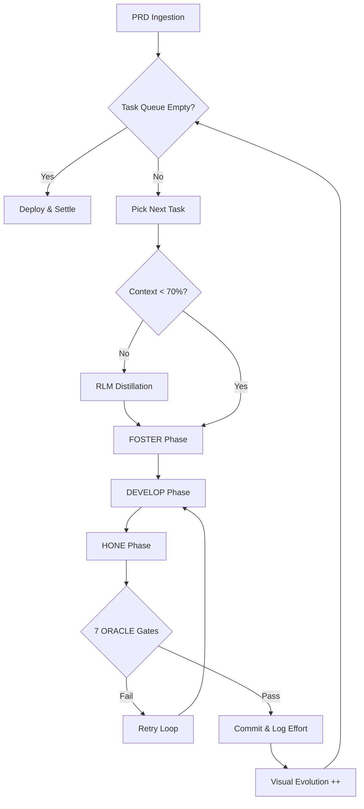

# CHICKEN HAWK FRAMEWORK
## Autonomous Effort Engine for Binge Code

**Version:** 2.1 (Ralph Wiggum Pattern)  
**Architecture:** ORACLE Framework (Time-Agnostic)  
**License:** MIT / Private Enterprise  
**Status:** Production Ready

---

## 🦅 1. Executive Summary

**Chicken Hawk** is the autonomous execution harness for the Binge Code ecosystem. It is an **Effort Engine** that replaces human-managed timelines with a verifiable, autonomous loop.

Unlike traditional agents that "chat" with you, Chicken Hawk is designed to **run while you sleep**. It ingests a Product Requirements Document (PRD) and executes the **"Ralph Wiggum" Loop**: it relentlessly picks the next task, applies effort, and verifies results until the Definition of Done is met.

### **Core Philosophy**
1.  **Time is Irrelevant:** We do not measure hours. We measure **Tokens Consumed** and **Gates Passed**.
2.  **Context is a Resource:** We enforce a strict **70% Context Rule**. If memory drifts, we distill it immediately (RLM).
3.  **Verification is Absolute:** No code leaves the harness without passing the **7 ORACLE Gates**.

---

## ⚙️ 2. The Architecture

Chicken Hawk is a Python-based harness that wraps **Agent Zero** (or any LLM backend) in a rigid governance loop.



---

## 🧠 3. Context Engineering (The 70% Rule)

To prevent "agent drift" (where the AI forgets the goal after 50 turns), Chicken Hawk treats context as a finite budget.

### The Protocol
1. **Monitor:** The harness tracks token usage after every turn.
2. **Trigger:** When `current_context > 0.7 * max_window`:
   - PAUSE execution.
   - DISTILL conversation history into `docs/distilled-context.md` (using MIT RLM logic).
   - WIPE the active chat history.
   - INJECT the distilled summary + `standards.md` + `specs/current-task.yaml`.
   - RESUME execution.
3. **Result:** The agent stays "fresh" indefinitely, whether the job takes 10 minutes or 10 days.

### File Structure (Source of Truth)
> Memory lives in Files, not Chat.

```
project-root/
├── standards.md              # [Layer 1] Global Constraints (Immutable)
├── product.md                # [Layer 2] Scope & Architecture (Project-Level)
├── specs/
│   ├── prd.md                # [Layer 3] Definition of Done
│   ├── task-state.json       # The Brain: Tracks which tasks are closed
│   └── task-001.yaml         # Atomic Unit of Work
└── .chicken-hawk/
    ├── ledger.log            # Effort Audit Trail
    └── config.yaml           # Harness Settings
```

---

## 🛡️ 4. The 7 ORACLE Gates

Chicken Hawk enforces **Defense-in-Depth**. A task is only "Done" when all 7 gates return `TRUE`.

| Gate | Name | Function | Failure Action |
|------|------|----------|----------------|
| 1 | **Technical** | pytest pass, Lint clean, Coverage ≥ 80% | Auto-Fix Loop |
| 2 | **Virtue** | Alignment Score (f_virtue) ≥ 0.995 | Prompt Refinement |
| 3 | **Ethics** | Charter-Safe check (No internal cost leakage) | Content Filter |
| 4 | **Judge** | LLM Auditor compares Code vs. Spec | Spec Clarification |
| 5 | **Strategy** | Long-term value check (No tech debt hacks) | Architecture Review |
| 6 | **Perception** | VL-JEPA Visual Check (UI matches Design) | UI Tweak Loop |
| 7 | **Effort** | Token budget audit (Is this worth the cost?) | Budget Expansion |

---

## 🦅 5. Visual Evolution (The Feedback Loop)

Since there is no "Time Remaining" bar, Chicken Hawk uses a **Visual Evolution System** to indicate accumulated effort and system maturity.

*(Rendered in Terminal / ACHEEVY UI)*

### Stage 1: The Hatchling (0-10% Effort)
- **Indicator:** System Initializing, Planning, Researching.
- **Visual:** Small, unhatched or just-hatched pixel bird.

### Stage 2: The Hunter (10-80% Effort)
- **Indicator:** Heavy execution. Code generation. Loops running hot.
- **Visual:** Alert, focused hawk. Wings spread.

### Stage 3: The Powerhouse (80-100% Effort)
- **Indicator:** Final Verification. Deployment. "Super Saiyan" Aura.
- **Visual:** Muscular, glowing, dominant figure.

---

## 💻 6. The Harness Code (Stub)

The core logic for the Ralph Wiggum Loop:

```python
def run_chicken_hawk_loop(prd_file):
    state = load_state()
    
    while not state.is_complete():
        task = state.get_next_task()
        
        # 1. CONTEXT CHECK
        if token_counter.get_usage() > 0.70:
            perform_rlm_distillation()
            
        # 2. EFFORT APPLICATION
        agent.foster(task)
        agent.develop(task)
        
        # 3. VERIFICATION (7 Gates)
        if oracle.verify_all_gates(task):
            state.mark_complete(task)
            visuals.evolve() # Logo Level Up
            commit_to_git()
        else:
            state.log_retry(task)
            # Loop continues...
```

---

## 🚀 7. Deployment

Chicken Hawk is designed to run in:

1. **Local Terminal:** `python chicken_hawk.py` (for dev/testing)
2. **ACHEEVY Sandbox:** Inside the E2B container (for production runs)
3. **CI/CD Pipeline:** As a "Nightly Builder" that picks up JIRA tickets.

### Installation:

```bash
cd chickenhawk
python chicken_hawk.py --mode autonomous --prd specs/prd.md
```

---

*Created by the Binge Code Initiative • SmelterOS v2.1.0*
